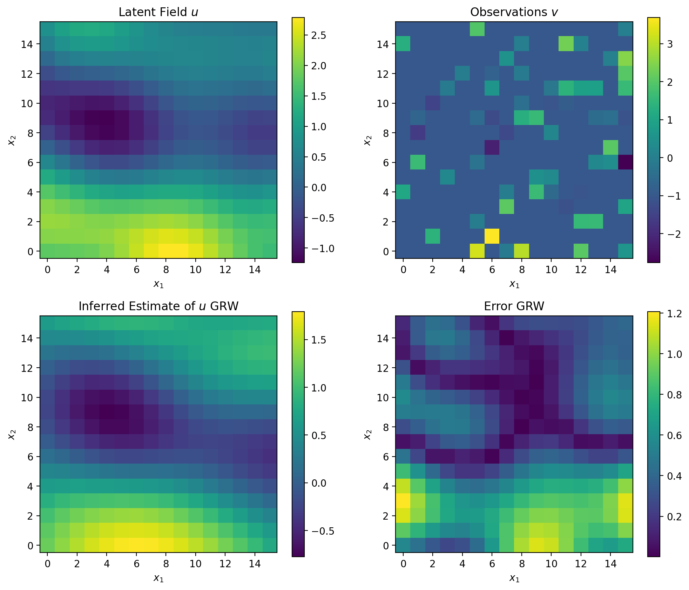
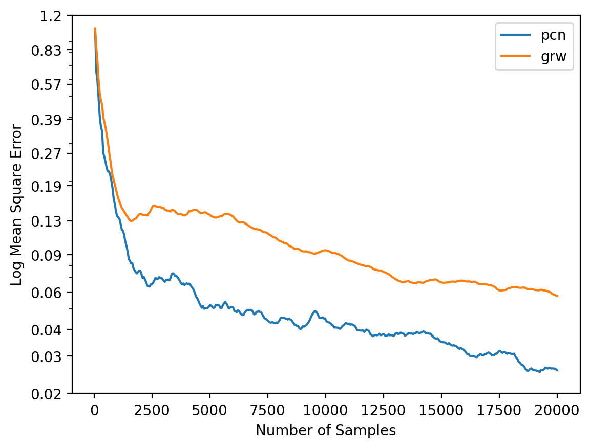

# Gaussian Processes + High-Dimensional MCMC

Full detail is given in [the report](report.pdf).

## Summary

This project uses Gaussian Processes and High Dimensional sampling to infer a latent field from noisy, sparse observations. This is done firstly with simulated data and then with real spatial bike theft data.

Sampling algorithms are compared in high dimensions, demonstrating the robustness of the pre-conditioned crank nicholson method (PCN), since it is well defined in an infinite dimensional space.

This work was coursework, some provided functions are ommitted to avoid this repository being found via search matches. Please contact me if you would like to see the full code.